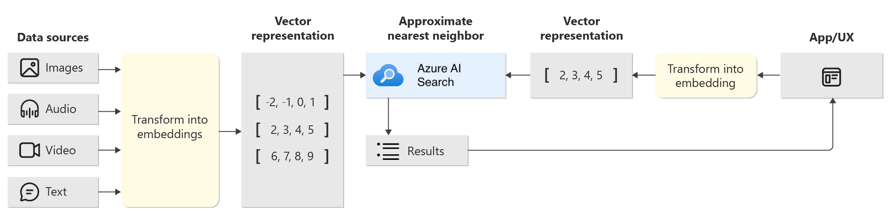
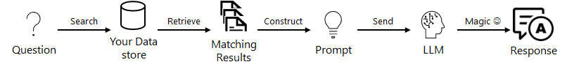

# Azure AI Studio: LangChain Quickstart Sample

This project use the AI Search service to create a vector store for a custom department store data.  We will be using Azure OpenAI's text-embedding-ada-002 deployment for embedding the data in vectors. The vector representation of your data is stored in [Azure AI Search](https://learn.microsoft.com/en-us/azure/search/search-what-is-azure-search) (formerly known as "Azure Cognitive Search").  
To enable the user to ask questions our data in a conversational format, we'll using Langchain to connect our prompt template with our Azure OpenAI LLM.

We'll use Retrieval Augmented Generation (RAG), a pattern used in AI which uses an LLM to generate answers with your own data. In addition, we'll  construct prompt template to provide the scope of our dataset, as well as the context to the submit questions. Lastly, we'll maintain the state of the conversation by store the chat history in the prompt.

**Custom Data:** The sample data that we'll be using in this project is a department store dataset.  The dataset contains a list of customers, orders, products and their descriptions, and their prices.  We'll be using this dataset to create a copilot that can answer questions about the products in the dataset.

This is the basic quickstart tutorial for the Azure AI Studio using Langchain. Find other framework-specific tutorial here:
 - [Azure AI Studio: Semantic Kernel Quickstart](https://github.com/Azure-Samples/aistudio-python-semantickernel-sample)
 - [Azure AI Studio: PromptFlow Quickstart](https://github.com/Azure-Samples/aistudio-python-promptflow-sample)
  - [Azure AI Studio: Python Quickstart](https://github.com/Azure-Samples/aistudio-python-quickstart-sample)

## 🧰 | Explore features of Azure AI Studio

The sample showcases features from the [Azure AI Studio preview](https://aka.ms/azureai/docs):

* [Azure AI Studio](https://aka.ms/azureaistudio/docs) - build, evaluate, deploy, your AI solution from one UI.
* [Azure AI Services](htthttps://aka.ms/azureaistudiops://learn.microsoft.com/azure/ai-services/what-are-ai-services) - core AI Service APIs & Models usable in Azure AI Studio 
* [Azure AI SDK](https://learn.microsoft.com/azure/ai-studio/how-to/sdk-install) - for programmatic access to Azure AI Services.
* [Azure AI CLI](https://learn.microsoft.com/azure/ai-studio/how-to/cli-install) - for command-line access to Azure AI Services.

> [!WARNING]  
> Features contained in this repository are in private preview. Preview versions are provided without a service level agreement, and they are not recommended for production workloads. Certain features might not be supported or mvght have constrained capabilities. For more information, see [Supplemental Terms of Use for Microsoft Azure Previews](https://azure.microsoft.com/support/legal/preview-supplemental-terms/).

## 👩🏽‍💻 | Build a copilot with your own data

Learn to build your own copilot using the Azure AI Studio with core resources (Azure AI Services) and tools (Azure AI SDK, Azure AI CLI). The tutorial guides you through the following steps:

1. Setup and validate your development environment.
2. Create an Azure AI project and AI resources for your copilot.
3. Create an Azure AI search index for your custom data.
4. Validate copilot by asking a question about your custom data.
5. Evaluate the performance of your copilot implementation.
6. (Optional) Deploy the copilot to Azure and invoke it.

## 🏁 | Let's Get Started!

Ready to get started building a copilot with your own custom data? 
- [**Start here**](docs/use-github-codes.md) to setup your development environment, then work through the remaining steps.
- [**Run local via CLI**](docs/use-locally.md) if you want to get started in your local environment.

## 📚 | Relevant Resources

1. [Azure AI Studio](https://aka.ms/azureaistudio) - UI to explore, build & manage AI solutions.
1. [Azure AI Studio Docs](https://learn.microsoft.com/azure/ai-studio) - Azure AI Studio documentation.
1. [Azure AI Services](https://learn.microsoft.com/azure/ai-services/what-are-ai-services) - Azure AI Services documentation.
1. [Training: Using vector search in Azure Cognitive Search](https://learn.microsoft.com/training/modules/improve-search-results-vector-search) 
1. [Tutorial: Deploy a web app for chat on your data](https://learn.microsoft.com/azure/ai-studio/tutorials/deploy-chat-web-app) 
